<div align="center">

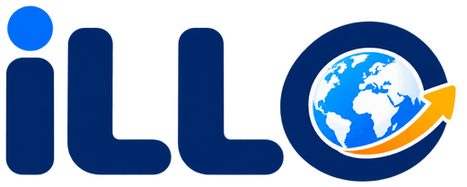

### Understand Your Work. Know Your Rights.

**한국어를 몰라도, 법을 몰라도 — 계약서 사진 한 장이면 됩니다.**

외국인 근로자가 근로계약서·급여명세서의 문제를 확인하고,
고용노동부 진정서 작성과 제출처 확인까지 한 번에 끝내는 다국어 권리구제 서비스

<br/>

[](https://illo.kro.kr/index)
[](https://github.com/KTB4-hackathon-6)


</div>

<br/>

> [!NOTE]
> ILLO가 제공하는 결과는 법률 상담이나 행정기관의 판단을 대신하지 않으며, 진정서를 사용자 대신 제출하지 않습니다.

<br/>

## 목차

| | |
| --- | --- |
| [1. 프로젝트 소개](#1-프로젝트-소개) | 왜 만들었는지, 무엇을 해결하는지 |
| [2. 데모](#2-데모) | 전체 흐름 미리보기 |
| [3. 주요 기능](#3-주요-기능) | 화면별 기능 상세 |
| [4. 기술 스택](#4-기술-스택) | 사용 기술 |
| [5. 아키텍처](#5-아키텍처) | 서비스 구조 · AI 에이전트 · 법령 RAG |
| [6. 로컬 실행](#6-로컬-실행) | 개발 환경 세팅 |
| [7. API](#7-주요-공개-api) | 공개 엔드포인트 |
| [8. 구현 범위와 한계](#8-현재-구현-범위와-제한사항) | 알려진 제약 |
| [9. 팀원 소개](#9-팀원-소개) | 만든 사람들 |

<br/>

## 1. 프로젝트 소개

### 배경

외국인 노동자 임금체불은 매년 커지고 있지만, 정작 당사자는 자신이 피해를 입었는지조차 알기 어렵습니다.

| 구분 | 2024년 | 2025년 | 증감 |
| --- | --- | --- | --- |
| 임금체불액 | 1,108억 원 | **1,601억 원** | ▲ 44% |
| 피해 근로자 | 23,254명 | **31,580명** | ▲ 35.8% |

> 계약서를 작성한 이주노동자 중 **내용을 충분히 이해한 사람은 31.0%**, **번역본을 받지 못한 사람은 51.6%**
>
> <sub>출처: 고용노동부 「외국인근로자 임금체불 현황」(강득구 의원실) · 거제시비정규직노동자지원센터 「2024년 거제시 이주노동자 노동환경 실태조사」(n=467)</sub>

### 문제

E-9 고용허가제 협정국은 17개국이지만 근로계약서·급여명세서·진정서는 **전부 한국어**입니다.
문제를 인지하고 진정서를 접수하기까지, 지금은 이 모든 과정을 혼자 해야 합니다.

```text
문제 인지 → 번역·해석 → 위반 여부 검색 → 상담처 탐색 → 1350 전화 → 통역 대기
  → 필요 서류 확인 → 서류 수집 → 양식 다운로드 → 진정서 작성 → 관할 노동청 확인 → 접수
```

**12단계 · 매 단계마다 한국어와 법률 지식이 필요합니다.**

### 해결

ILLO는 이 12단계를 **계약서 사진 첨부 1번**으로 접습니다.

<div align="center">

| | 첨부 | → | 진단 | → | 서류 | → | 연결 |
| --- | --- | --- | --- | --- | --- | --- | --- |
| **하는 일** | 근로계약서 이미지 1장 | | 위반 사항 정리 | | 진정서 자동 작성 | | 어디에·누구에게 |
| **걸리는 시간** | 10초 | | 약 1분 | | 대화 몇 번 | | 즉시 |

</div>

기존 「고용노동부 × 한국공인노무사회 다국어 AI 노동법 상담」이 **질문에 답하는 챗봇**이라면,
ILLO는 **내 문서를 읽고 → 문제를 찾아 → 서류까지 만들어 주는** 서비스입니다.

<br/>

## 2. 데모

<div align="center">

**[illo.kro.kr →](https://illo.kro.kr/index)**

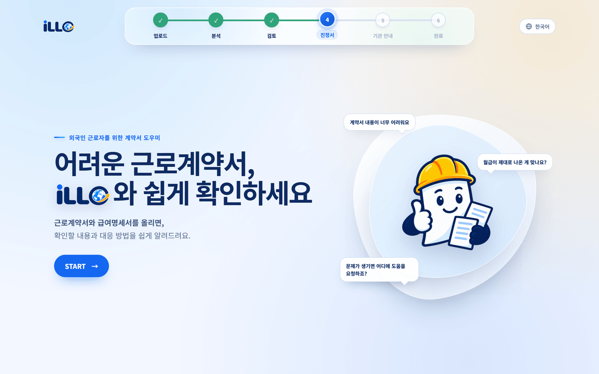

<br/><br/>

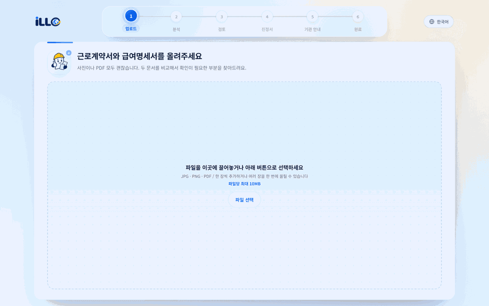

<sub>업로드 → 분석 → 검토 결과 → 진정서 작성 → 기관 안내</sub>

</div>

<br/>

## 3. 주요 기능

### 문서 업로드 · 비동기 분석

| 업로드 | 분석 진행 |
| --- | --- |
| 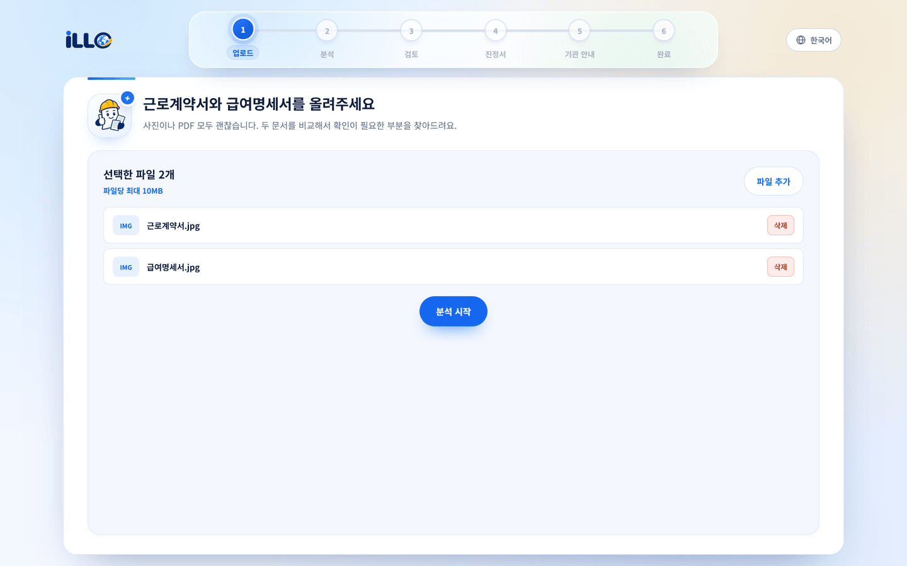 | 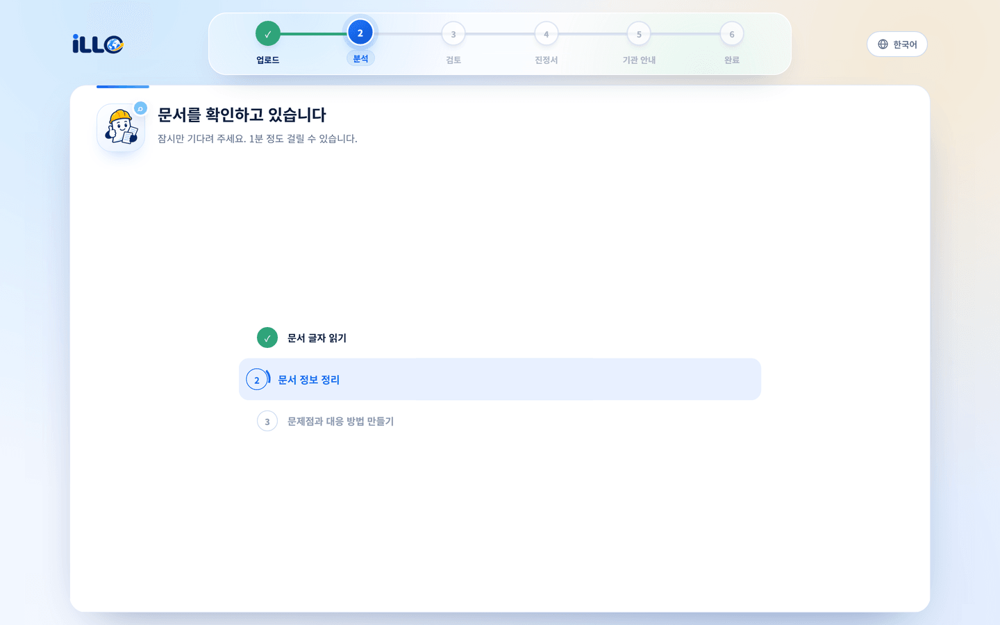 |
| 근로계약서와 급여명세서를 JPG·PNG·PDF로 함께 올립니다. 파일당 최대 10MB. | `OCR → 구조화 → AI 검토` 3단계를 화면에 실시간 표시합니다. |

### 검토 결과 — 계약서와 명세서 교차 검증

| 검토 결과 |
| --- |
| 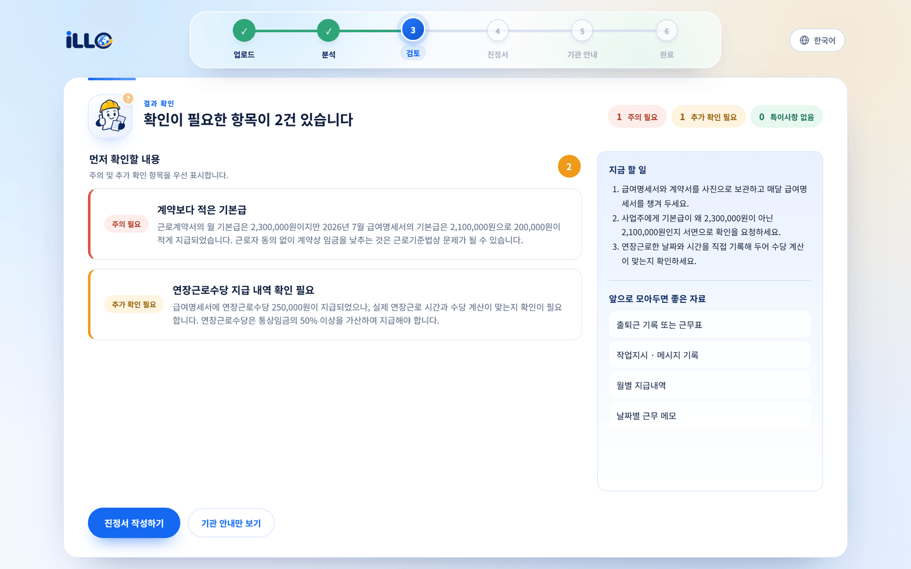 |
| 계약서의 월급(2,300,000원)과 급여명세서 기본급(2,100,000원)을 대조해 **200,000원 미지급**을 찾아냅니다. 각 항목은 `주의 필요` / `추가 확인 필요` / `특이사항 없음`으로 분류되고, 오른쪽에는 **지금 할 일**과 **모아둘 증빙자료**가 함께 제시됩니다. |

### 진정서 작성 — 대화형 에이전트

| 자동 추출 + 첫 질문 | 한 번에 하나씩 |
| --- | --- |
| 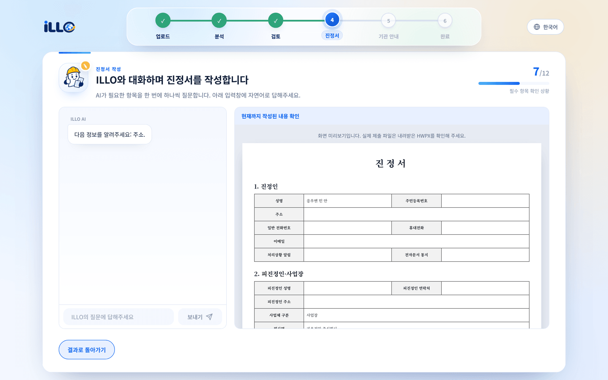 | 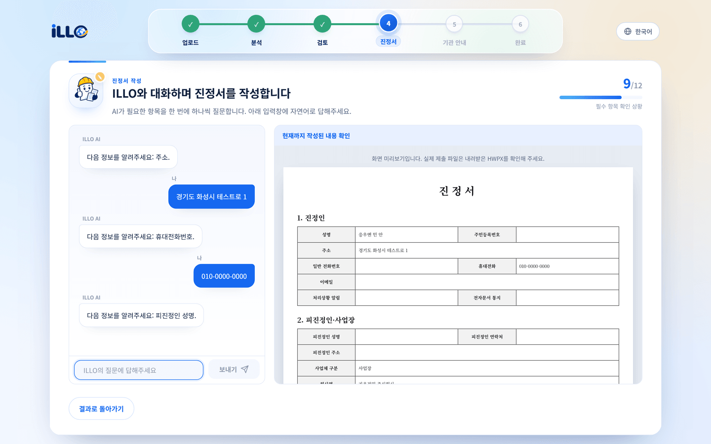 |
| 성명·사업장·근무기간·업무 내용을 문서에서 **자동 추출**해 진정서에 채웁니다. | 부족한 필수 항목만 하나씩 질문하고, 답할 때마다 **오른쪽 미리보기에 실시간 반영**됩니다. 완료 시 고용노동부 양식과 동일한 HWPX로 내려받아 그대로 접수할 수 있습니다. |

### 기관 안내

| 제출처 안내 |
| --- |
| 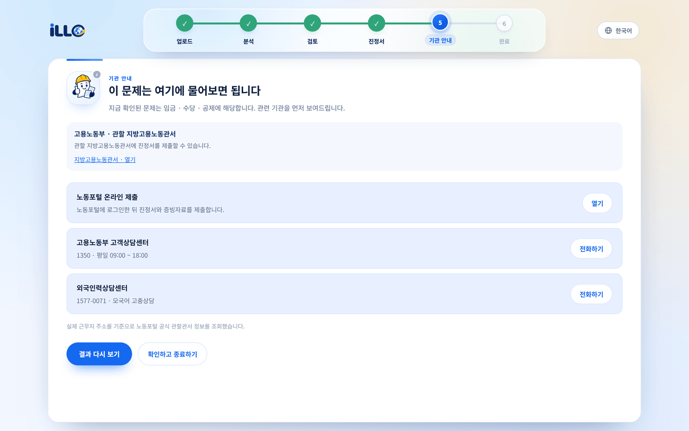 |
| 실제 근무지 주소를 기준으로 **관할 지방고용노동관서**를 조회하고, 노동포털 온라인 제출 경로·고용노동부 고객상담센터(1350)·외국인력상담센터(1577-0071)를 함께 안내합니다. |

### 다국어 지원 — 7개 언어

| 언어 선택 | 베트남어 검토 결과 |
| --- | --- |
| 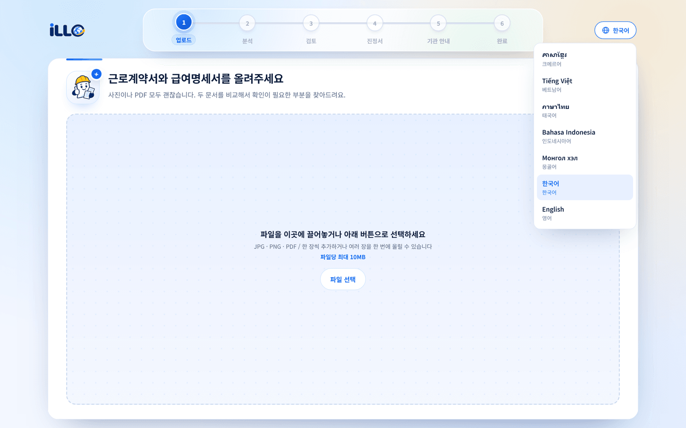 | 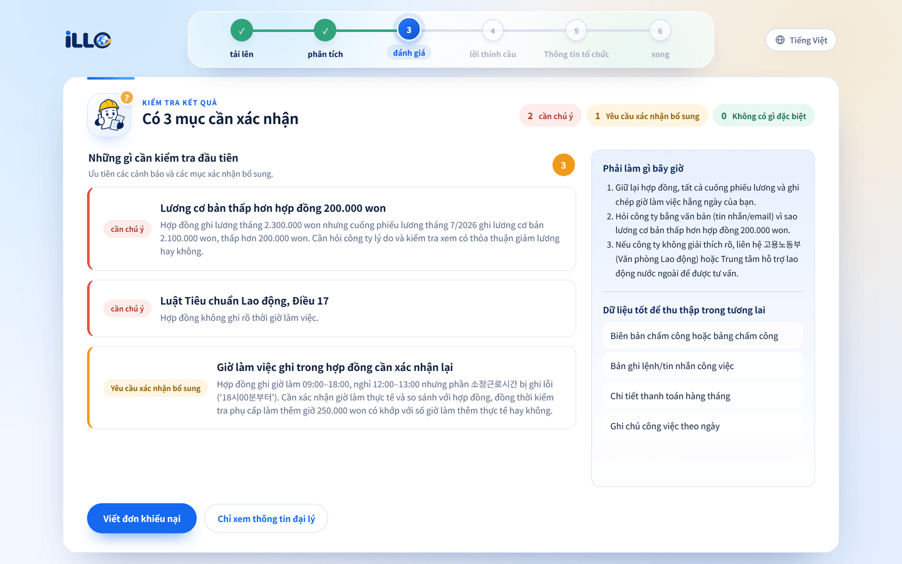 |
| 한국어 · English · Tiếng Việt · ภาษาไทย · Bahasa Indonesia · Монгол хэл · ភាសាខ្មែរ | UI뿐 아니라 **AI 검토 결과와 대응 방법까지** 선택한 언어로 생성됩니다. |

<br/>

## 4. 기술 스택

#### Frontend


<br/>


#### Backend


#### AI


<br/>


#### Infra & External


<br/>


<br/>

## 5. 아키텍처

### 서비스 구조

```text
                    ┌──────────────┐  ┌──────────┐  ┌──────────┐  ┌──────────────┐
                    │  CLOVA OCR   │  │ DeepSeek │  │ Upstage  │  │ 국가법령정보   │
                    └──────┬───────┘  └────┬─────┘  └────┬─────┘  └──────┬───────┘
┌ Docker Compose ──────────┼───────────────┼─────────────┼───────────────┼────────┐
│                          │               │             │               │        │
│  사용자 ─ Caddy 2 ─ Frontend ─── /api ── Backend API ───┼───────────────┼───     │
│           (TLS)     React 19          Spring Boot 4.1   │               │        │
│                     Nginx 1.27        ├ 세션 · 비동기 작업│               │        │
│                                       ├ OCR 호출         │               │        │
│                                       ├ 규칙 기반 검사    │               │        │
│                                       └ HWPX 생성        │               │        │
│                                            │                            │        │
│                                    /review │ /docs · /guide             │        │
│                                            ▼                            │        │
│                                       AI Service ───────────────────────┘        │
│                                       FastAPI · LangGraph                        │
│                                       ├ 문서 검토 에이전트                          │
│                                       ├ 서류 작성 워크플로우                        │
│                                       └ 법령 Retrieval Tool                       │
│                                            │                                     │
│         ┌──────────────┬───────────────────┼──────────────────┐                  │
│    In-memory        HWPX              SQLite               ChromaDB              │
│   세션 · Job      Template · Output   LangGraph 체크포인트    법령 Vector Store     │
└──────────────────────────────────────────────────────────────────────────────────┘
```

Spring의 공개 API는 성공과 실패 모두 다음 봉투 형식을 사용합니다.

```json
{ "code": "SUCCESS", "data": {} }
```

### 처리 흐름

```text
문서 이미지 업로드
  → CLOVA OCR 텍스트 추출
  → 경량 LLM 구조화 (industry, monthly_wage, hourly_wage, weekly_working_hours,
                    accommodation_deduction_krw, payment_date_specified ...)
  → 룰베이스 법령 기반 판단
  → 위반 사항을 에이전트로 전달
```

규칙으로 결정 가능한 항목(최저임금 미달, 법정 근로시간 초과, 숙식비 과다 공제 등)은 **백엔드 규칙 엔진**이 판정하고,
법적 맥락이 필요한 항목은 **RAG 기반 AI**가 관련 법령과 함께 설명합니다.

### AI 에이전트 워크플로우

```text
문서 업로드 → OCR · 구조화 · 규칙 기반 검토
                        │
                        ▼
              ┌─────────────────────┐
              │  문서 검토 에이전트   │ ──┐
              └─────────────────────┘   │
                                        ▼
                                 세션 체크포인트
                                        │
              ┌─────────────────────┐   │
              │  서류 작성 에이전트   │ ◀─┘
              └─────────┬───────────┘
                        ▼
                   제출 서류 → 노동기관 안내
```

**문서 검토 에이전트**

1. 계약서·급여명세서를 검토해 문제 상황을 발견
2. 필요한 경우 법령 Retrieval Tool을 **자율적으로 호출**해 근거를 확인
3. 규칙 검증 결과를 포함해 문제 사항을 정리 후 설명 생성, 세션 체크포인트에 저장

**서류 작성 에이전트**

1. 세션 체크포인트에서 문서와 검토 에이전트가 정리한 문제 사항을 불러옴
2. 계약서·급여명세서에서 성명·사업장·근무기간·업무 등의 값을 **자동 추출**
3. 부족한 필수 항목을 사용자에게 **한 번에 하나씩** 질문하며 실시간으로 문서에 반영

### 법령 RAG

```text
법령 스냅샷 ──▶ Upstage Embedding ──▶ ChromaDB ──▶ 법령 Retrieval Tool
 근로기준법          solar-embedding-1-large        search_labor_law
 최저임금법                                                ▲   │
 외국인근로자의 고용 등에 관한 법률                    tool_call │   │ tool_result
 근로자퇴직급여 보장법                                        │   ▼
 임금채권보장법                                        문서 검토 에이전트
```

국가법령정보센터 Open API로 위 5개 법령을 동기화하며, 동기화 키가 없거나 실패하면 저장소의 기존 스냅샷을 사용합니다.

<br/>

## 6. 로컬 실행

### 사전 요구사항

- Java 26 · Node.js 24 & npm · Python 3.12+ · [uv](https://docs.astral.sh/uv/)

전체 분석 흐름에는 다음 자격 증명이 필요합니다.

| 환경변수 | 용도 |
| --- | --- |
| `NAVER_OCR_INVOKE_URL`, `NAVER_OCR_SECRET_KEY` | 문서 OCR |
| `DEEPSEEK_API_KEY` | 근로조건 구조화와 AI 검토 |
| `UPSTAGE_API_KEY` | 법령 RAG 임베딩 |

### 1. 환경변수

```bash
cp .env.example .env
```

AI 서버는 루트 `.env`를 읽습니다. Spring Boot는 `.env`를 자동으로 읽지 않으므로 실행할 셸에 값을 내보내야 합니다.

```bash
set -a
source .env
AI_BASE_URL=http://localhost:8000
set +a
```

실제 키와 개인정보는 `.env`, 코드, 로그 또는 Git에 추가하지 않습니다.
자세한 설정은 [`backend/.env.example`](backend/.env.example), [`frontend/.env.example`](frontend/.env.example)을 참고하세요.

### 2. AI 서버

```bash
cd ai && uv sync && uv run ai-agent
```

문서 `http://localhost:8000/docs` · 상태 확인 `http://localhost:8000/health`

### 3. 백엔드

```bash
cd backend && ./gradlew bootRun
```

Swagger UI `http://localhost:8080/swagger-ui.html` · OpenAPI `http://localhost:8080/v3/api-docs`

### 4. 프론트엔드

```bash
cd frontend && npm install && npm run dev
```

`http://localhost:5173` · Vite가 `/api`를 `http://localhost:8080`으로 프록시합니다.

### 테스트

```bash
cd backend && ./gradlew test          # Backend
cd frontend && npm test && npm run lint   # Frontend
cd ai && uv run pytest && uv run ruff check .   # AI
```

실제 외부 모델을 호출하는 AI 평가는 기본적으로 건너뜁니다. `RUN_LIVE_RAG=1` 또는 `RUN_LIVE_AI_EVAL=1`로 별도 실행할 수 있습니다.

<br/>

## 7. 주요 공개 API

| Method | Path | 설명 |
| --- | --- | --- |
| `POST` | `/api/sessions` | 30분 TTL의 임시 상담 세션 생성 |
| `POST` | `/api/sessions/{sessionId}/contract-analyses` | 비동기 근로계약서 분석 시작 |
| `GET` | `/api/sessions/{sessionId}/contract-analyses/{analysisId}` | 분석 단계와 결과 조회 |
| `POST` | `/api/contracts/diagnose` | 근로계약서 OCR·구조화·규칙 진단 |
| `POST` | `/api/contracts/analyze` | 근로계약서 진단과 AI 검토를 동기 실행 |
| `POST` | `/api/payslips/diagnose` | 급여명세서 OCR·구조화·규칙 진단 |
| `POST` | `/api/employment-documents/cross-check` | 계약서와 급여명세서 대조 |
| `POST` | `/api/sessions/{sessionId}/chat` | 세션 문맥을 사용한 상담 메시지 처리 |
| `GET` | `/api/sessions/{sessionId}/messages` | 세션 메시지 조회 |
| `POST` | `/api/sessions/{sessionId}/documents` | 진정서 정보 보완 및 HWPX 생성 |
| `POST` | `/api/sessions/{sessionId}/guidance` | 관할 기관과 제출 절차 안내 |

정확한 스키마는 실행 중인 Swagger UI에서 확인할 수 있습니다.
Spring과 FastAPI 사이의 내부 계약은 [`docs/api/analysis-api.md`](docs/api/analysis-api.md)에 정리되어 있습니다.

<br/>

## 8. 현재 구현 범위와 제한사항

- 메인 프론트엔드 흐름은 근로계약서 분석, 진정서 작성, 제출 안내에 연결되어 있습니다. 급여명세서 단독 진단과 계약서 대조는 공개 백엔드 API로만 제공됩니다.
- 프론트엔드는 선택한 파일을 그대로 서버에 전송합니다. 클라이언트 측 민감정보 가림 기능은 설계 문서만 존재하며 현재 업로드 흐름에는 구현되어 있지 않습니다.
- Spring의 상담 세션과 비동기 작업 상태는 메모리에 저장되며 기본 TTL은 30분입니다. 서버 재시작 시 사라지고 여러 인스턴스 사이에서 공유되지 않습니다.
- AI 대화 체크포인트는 로컬 SQLite, 법령 검색 인덱스는 로컬 Chroma에 저장됩니다. 다중 인스턴스 운영을 위한 공유 저장소는 구성되어 있지 않습니다.
- 업로드 형식은 PDF·JPEG·PNG이며 파일당 최대 10MB, 한 요청은 최대 21MB입니다. 프론트엔드는 선택 파일 합계를 20MB로 제한합니다.
- 관할 관서 자동 조회가 실패하면 고용노동부의 공식 관할관서 검색 페이지와 공통 상담 채널을 안내합니다.
- 규칙 엔진 문구는 `rule_id` 기준으로 7개 언어 번역을 제공합니다. 다만 AI 검토 문장은 계약서 원문(예: `소정근로시간`)이나 기관명(`고용노동부`)을 그대로 인용할 수 있어, 번역문 안에 한국어 원어가 함께 표시될 수 있습니다.
- `docker-compose.yml`에는 MongoDB와 S3 환경변수 등 배포용 구성이 포함되어 있지만, 현재 서비스 코드의 세션·분석 저장소는 이를 사용하지 않습니다.

<br/>

## 9. 팀원 소개

<div align="center">

|  |  |  |  |  |  |
| :---: | :---: | :---: | :---: | :---: | :---: |
| Frontend · Backend | Frontend | Backend | Backend · AI | AI | AI |
| [@yh112](https://github.com/yh112) | [@mnz3o](https://github.com/mnz3o) | [@dlawnsdnjs](https://github.com/dlawnsdnjs) | [@SeoSeungMin1](https://github.com/SeoSeungMin1) | [@SungjinWi99](https://github.com/SungjinWi99) | [@kkkk2058](https://github.com/kkkk2058) |

</div>

<br/>

## 관련 문서

- [로컬 개발환경 설정](SETUP.md)
- [ILLO 서비스 기능 명세](docs/ILLO_SERVICE_SPEC.md)
- [세션·채팅 API](docs/api/session-chat-api.md)
- [분석 API](docs/api/analysis-api.md)
- [진정서 HWPX 템플릿](docs/forms/labor-complaint.md)
- [AI 모듈](ai/README.md)

<div align="center">
<br/>
<sub>KTB 4기 AI 해커톤 · 6팀</sub>
</div>
